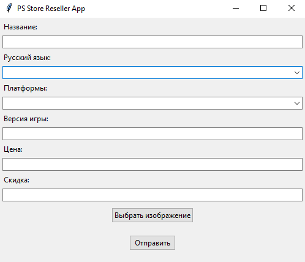

# PSStorePromoGenerator

A tool that I made to automatically generate promotional images for one VK community that resells PlayStation Store video games in the Turkey region. 
This tool lets you generate images like the following without the need to open Photoshop or any other similar editing tool.

## How to use it 
I never really bothered creating an .EXE file for this project, so I was just lounching it straight from PyCharm. But if you really want to use or customize it, I guess you can try to create one.
I don't really work for that VK group anymore, so I don't care.

After filling up all the blanks (part from "Скидка" one, it still doesn't work; you can just skip it), you can press on "Выбрать изображение" and choose the image you want to use for the background.
After that, you can click on "Создать" and wait until the image appears in the output folder.

That's it!

Feel free to use this program however you like.

## Main Tech Stack

**Python**

**TKinter**

**Pillow**

**BeautifulSoup4**

## Additional information

File scraper.py is my attempt to scrape all the information about the curtain game automatically to fill all the blanks in gui by just providing the link to the PS Store game's page. As you can see, this didn't really worked out the way I wanted to because the idiots that've made this website for some reason used different div classes' names for each page...
